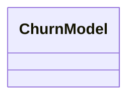
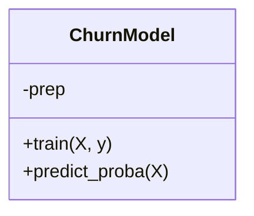
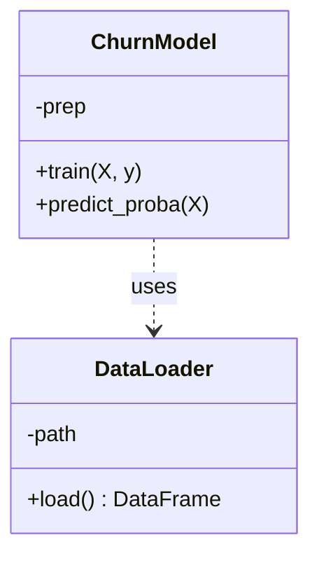
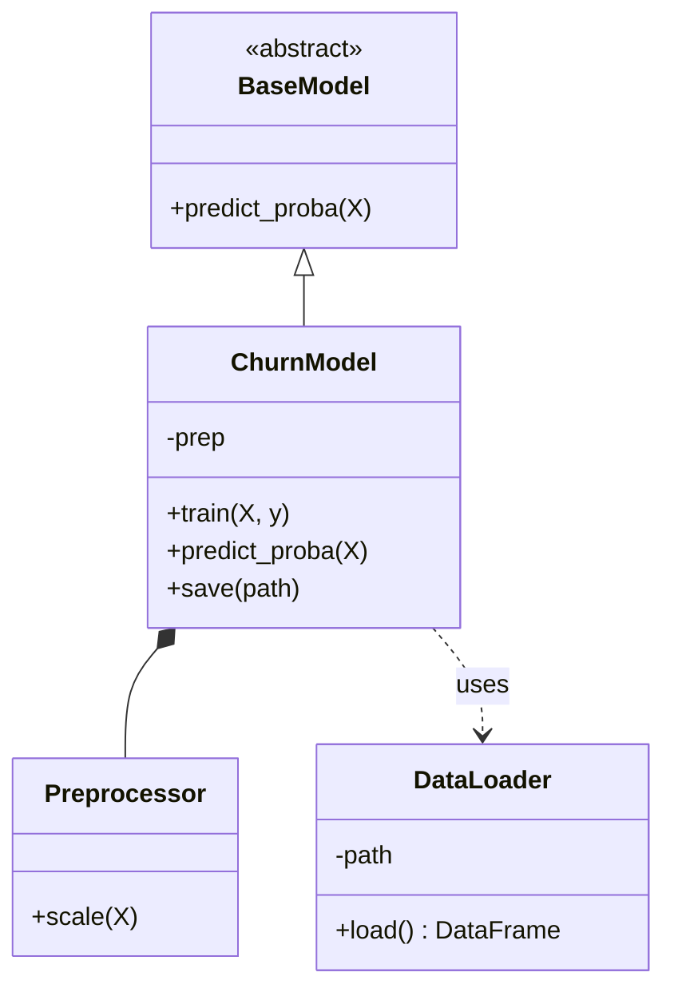
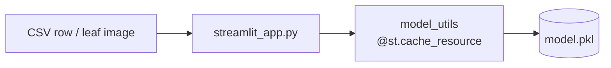

# L7 — Live Mermaid Demo

**How to show this live**
Open <https://mermaid.live> (nothing to install), or open this file in VS Code with the
"Markdown Preview Mermaid Support" extension. Paste each stage in turn and talk while the
diagram grows — that *is* the point: a diagram is just text.

---

## 1 · Class diagram — build it up live

### Stage 1 — one empty class


### Stage 2 — add the data and the methods (-/+ = private/public)


### Stage 3 — a second class, and a relationship


### Stage 4 — the full picture (abstract base + composition)


**Relationship cheat-sheet** (say these out loud as you add each arrow):
- `<|--` inheritance — *is a* (ChurnModel is a BaseModel)
- `*--` composition — *owns / part-of* (a ChurnModel owns its Preprocessor)
- `-->` association — *has / uses* a long-lived reference
- `..>` dependency — *uses temporarily* (passes through, doesn't keep)

---

## 2 · Component diagram — the app blueprint (flowchart)



Same shape for both projects — only the input box changes.

---

## 3 · Use case — Mermaid's one gap

Mermaid has **no** native use-case diagram. Show it on the slide (a stick figure + ovals),
or — if you want it as code too — use PlantUML (<https://www.plantuml.com/plantuml>):

```
@startuml
left to right direction
actor User
rectangle "ML App" {
  User --> (Provide input)
  User --> (Get a prediction)
  User --> (See confidence)
}
@enduml
```
