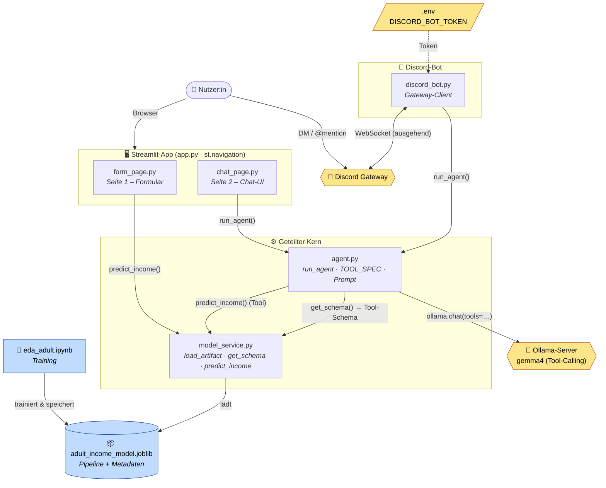
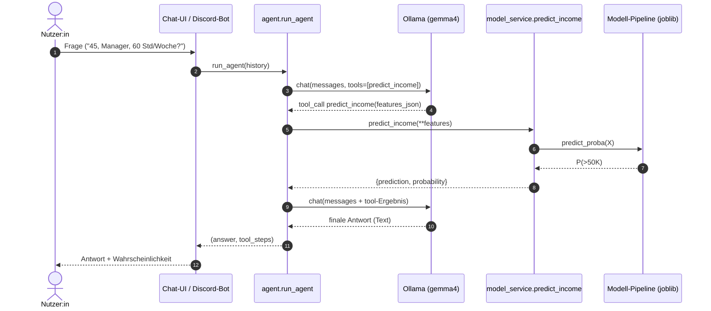

# Architektur — Lecture 09 Deployment

Komponentendiagramm der Anwendung (GitHub rendert Mermaid automatisch).



## Kernideen

- **`agent.py` + `model_service.py`** bilden den geteilten Kern — von der
  Streamlit-Chat-Seite **und** vom Discord-Bot wiederverwendet.
- Das **Formular** ruft das Modell **direkt** auf (`predict_income`), während
  **Chat und Bot** über den **Agenten** gehen, der das Modell als **Tool**
  aufruft.
- **gemma4 (Ollama)** und der **Discord-Gateway** sind externe Systeme; der
  Bot verbindet sich **ausgehend** (kein offener Port nötig).
- Das **Modell-Artefakt** wird vom Notebook erzeugt und ausschließlich von
  `model_service` geladen.

## Ablauf einer Chat-Anfrage (Tool-Calling)



## Mermaid-Quelldateien

Die rohen Diagrammquellen liegen unter [`diagrams/`](diagrams/) und lassen sich
mit jedem Mermaid-Renderer zu Bildern exportieren:

- [`diagrams/component.mmd`](diagrams/component.mmd) — Komponentendiagramm
- [`diagrams/sequence_chat.mmd`](diagrams/sequence_chat.mmd) — Sequenzdiagramm

```bash
# Beispiel: PNG/SVG erzeugen (Node nötig)
npx -p @mermaid-js/mermaid-cli mmdc -i diagrams/component.mmd -o component.svg
```
