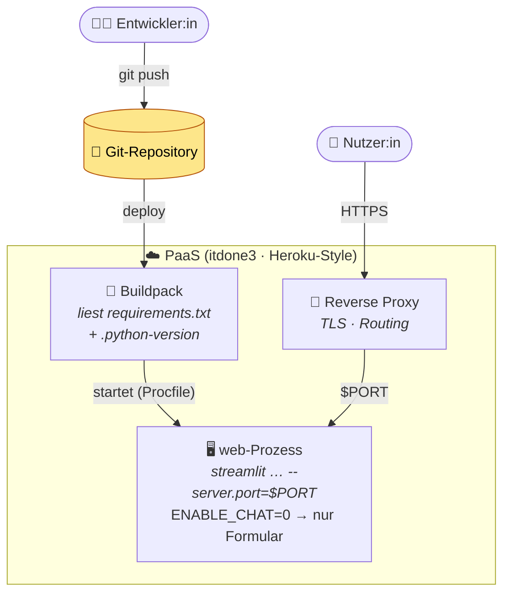

# Architektur — Lecture 10 Cloud-Deployment

In Lecture 09 lief alles **lokal**. Hier bringen wir dieselbe App in die
**Cloud** auf eine PaaS (itdone3, Heroku-Style). Der entscheidende Unterschied
steckt nicht im Modell, sondern in der **Laufzeitumgebung**.

## Lokal vs. Cloud — was läuft wo?

| | Lokal (Lecture 09) | Cloud (Lecture 10) |
|---|---|---|
| Formular-Seite | ✅ | ✅ |
| Chat-Agent (Ollama) | ✅ (Ollama-Server läuft mit) | ❌ kein Ollama-Server / GPU |
| Port | frei (8501) | von der Plattform via `$PORT` vorgegeben |
| Start | `streamlit run app.py` | `Procfile` (web-Prozess) |
| TLS / öffentliche URL | nein | ja, vom Reverse Proxy |
| Secrets | `.env` / lokal | Plattform-Secrets (ENV) |

**Kernpointe:** Ein lokaler LLM (Ollama) ist an deine Maschine gebunden — er
zieht ein Modell von mehreren GB und braucht idealerweise eine GPU. Eine
typische PaaS gibt dir einen schlanken Container ohne GPU und ohne Ollama. Was
lokal selbstverständlich ist, lässt sich also **nicht 1:1 deployen**. Wir lösen
das hier pragmatisch: In der Cloud läuft nur die **Formular-Seite** (sie braucht
keinen LLM), gesteuert über `ENABLE_CHAT=0`. Den Agenten cloud-fähig zu machen
(gehosteter LLM-API mit Tool-Calling) ist das Thema einer späteren Lecture.

## Deployment-Fluss

## Die 12-Factor-Ideen, die hier auftauchen

- **Port-Binding:** Die App bindet an einen von außen vorgegebenen `$PORT` —
  sie sucht ihn sich nicht selbst aus.
- **Config über die Umgebung:** Verhalten (`ENABLE_CHAT`) und Geheimnisse
  kommen aus ENV-Variablen, nicht aus dem Code.
- **Dependencies explizit:** `requirements.txt` deklariert *alles*; der
  Buildpack baut reproduzierbar daraus.
- **Build, release, run getrennt:** Buildpack baut, `Procfile` startet.
- **Stateless:** Der Prozess hält keinen wichtigen Zustand im RAM — ein
  Neustart darf jederzeit passieren.

Quelle der rohen Diagramme: [`diagrams/deployment.mmd`](diagrams/deployment.mmd).
